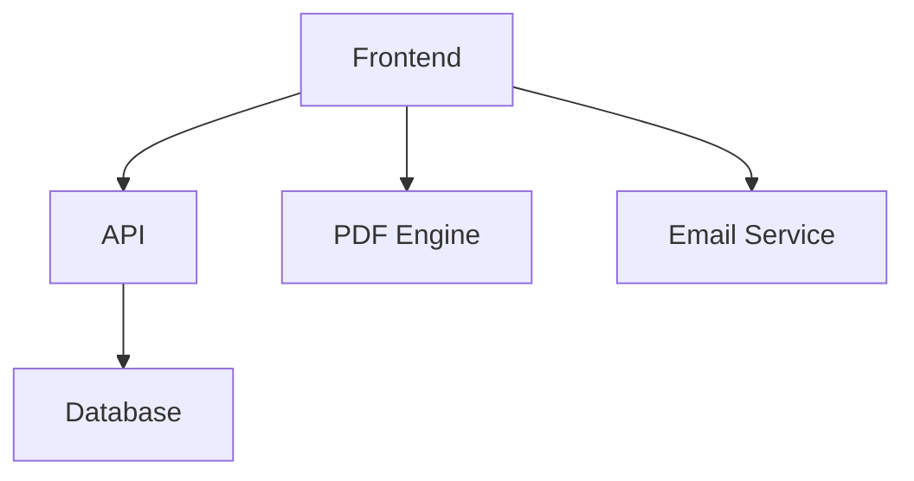

# AOPIA-LIKE Project Analysis Report

## Executive Summary
This report analyzes the AOPIA-LIKE project (WizzyLearn application) addressing CPF regulation changes. The system enables a dual-formation pathway (2 x €1,500 = €3,000) with traceable, secure processes for Caisse des Dépôts compliance.

## Key Components
1. **Frontend**: Vue.js 3 with Vite, Pinia, Tailwind CSS
2. **Backend**: NestJS with TypeORM
3. **Database**: PostgreSQL (Prod), SQLite (Dev)
4. **Key Features**: Adaptive testing, PDF report generation, automated email workflows

## Technical Architecture

## Implementation Status
- P3 Filter Rules: ✅ Complete with 90% test coverage
- Database Models: ✅ Production-ready
- Security: ✅ Timestamped audit trails

## Recommendations
1. Expand P3 rules to cover more formation categories
2. Implement real-time validation for form selection
3. Add Docker monitoring for production deployment