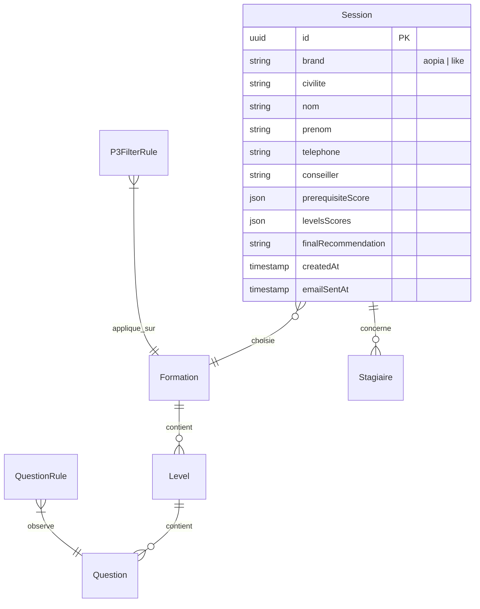

# 🗂️ Index et Guide Technique du Projet AOPIA (WizzyLearn)

Ce document fournit une analyse complète et structurée du projet de test de positionnement et d'analyse des besoins **WizzyLearn** pour **AOPIA et LIKE Formation**. Il fait office de cartographie de référence et de manuel opérationnel ("Skills") pour les développeurs et agents d'IA intervenant sur cette base de code.

---

## 📖 1. Contexte Métier & Fonctionnalités Clés

### 🎯 Problématique & Objectifs
La réforme réglementaire du CPF a imposé un plafond maximal de **1 500 € par formation**, diminuant de moitié le panier moyen historique (3 000 €). Pour s'adapter commercialement et légalement, l'entreprise a développé un outil d'analyse des besoins qui oriente le candidat vers un **parcours combiné de 2 formations** (2 × 1 500 € = 3 000 €) de manière traçable, sécurisée et horodatée pour répondre aux audits de la Caisse des Dépôts.

### 🛤️ Parcours Utilisateur en 5 Étapes
1. **Identification (`HomeView.vue`)** : Collecte des informations du candidat et association à son conseiller commercial (formation multi-marques AOPIA / LIKE).
2. **Situation & Pré-requis (`PrerequisView.vue`)** : Diagnostic du métier, situation professionnelle et des compétences numériques générales.
3. **Sélection de Formation (`FormationSelectionView.vue`)** : Choix de la formation ciblée (Anglais TOEIC, Excel, Google Sheets, etc.).
4. **Test de Positionnement (`PositionnementView.vue`)** : Test progressif et adaptatif par niveau (ex: A1, A2, B1, B2). En cas de réussite, le test continue. En cas d'échec ou d'arrêt, l'algorithme génère la préconisation adaptée.
5. **Résultats & Validation (`ResultatsView.vue` + `FinalValidationView.vue`)** : Recommandation de parcours automatisée (badge parcours P1, P2, P1 & P2, ou P3), génération d'un rapport PDF haute fidélité, envoi par e-mail au conseiller et archivage en base de données.

---

## 🏗️ 2. Architecture Technique et Stack Logicielle

L'application utilise une architecture découplée moderne :

| Couche | Technologies | Rôle principal |
| :--- | :--- | :--- |
| **Frontend** | Vue.js 3 (Composition API), Vite, Pinia, Tailwind CSS, Axios | Interface SPA premium responsive-first, animations fluides, gestion réactive du workflow utilisateur. |
| **Backend** | NestJS (TypeScript), TypeORM | API RESTful modulaire, gestion de la logique métier, génération PDF, envoi de mails automatiques. |
| **Persistance** | PostgreSQL (Prod), SQLite (Dev) | Stockage des questions, sessions, utilisateurs admins, règles de filtrage. |
| **Moteurs** | PDFKit, Nodemailer | Services de génération de documents haute qualité et intégration SMTP de reporting. |

---

## 📂 3. Indexation Récursive de la Structure du Projet

### 📁 3.1 Racine du Projet (Documentation & Utilitaires)
*   `CDC_Fonctionnel_WizzyLearn.md` : Spécifications des besoins métiers et contraintes du parcours.
*   `CDC_Technique_WizzyLearn.md` : Spécifications de la base de données et des endpoints API requis.
*   `FIL_DARIANE.md` : Cartographie logique simplifiée de l'expérience utilisateur et de l'architecture globale.
*   `CHANGELOG.md` : Suivi historique des mises à jour majeures, corrections de bugs et refactorings UI.
*   `ANALYSIS_P3_FILTER_RULES.md` : Analyse complète et détaillée de l'implémentation du moteur de filtrage P3.
*   `P3_IMPLEMENTATION_COMPLETE.md` : Compte-rendu technique de la mise en place de la restriction intelligente P3.
*   `convert_docs.py` : Script Python pour convertir les cahiers des charges `.docx` en Markdown (`.md`) avec extraction automatique d'images via `mammoth`.
*   `convert_msg.py` : Script utilitaire pour parser les fichiers e-mail Outlook `.msg`.
*   `docker-compose.yml` : Configuration des conteneurs locaux (PostgreSQL, PgAdmin, etc.).

---

### 📁 3.2 Backend NestJS (`/projet-app/backend/`)
Le backend est architecturé en modules NestJS autonomes situés sous `src/` :

```
backend/src/
├── admin/                 # Contrôleurs et services pour le Dashboard d'administration
├── auth/                  # Sécurité JWT, hashage bcrypt et contrôle d'accès
├── contacts/              # Gestion des fiches contacts/conseillers commerciaux
├── email/                 # Service d'envoi SMTP et templates HTML de mails premium
├── entities/              # Définitions des entités de la base de données (TypeORM)
│   ├── contact.entity.ts
│   ├── formation.entity.ts
│   ├── level.entity.ts
│   ├── p3-filter-rule.entity.ts
│   ├── parcours-rule.entity.ts
│   ├── question-rule.entity.ts
│   ├── question.entity.ts
│   ├── session.entity.ts
│   ├── setting.entity.ts
│   ├── stagiaire.entity.ts
│   ├── user.entity.ts
│   └── workflow-step.entity.ts
├── formations/            # CRUD et logique métier des formations disponibles
├── p3-filter-rules/       # Règles de filtrage intelligentes pour le parcours P3 (Shortcut)
├── parcours/              # Règles générales de recommandation de parcours
├── pdf/                   # Moteur PDF haute fidélité (PDFKit)
├── question-rules/        # Règles dynamiques basées sur les réponses de pré-requis
├── questions/             # Banque de questions de pré-requis et de positionnement
├── scripts/               # Scripts de migration et d'import de données
├── sessions/              # Cœur du moteur d'évaluation, scores et logique d'arrêt
├── settings/              # Paramètres globaux configurables en base de données
├── workflow/              # Logique de workflow dynamique et étapes utilisateur
├── app.module.ts          # Module racine important toutes les dépendances
├── main.ts                # Point d'entrée de l'application (Port 3001, CORS, Swagger)
└── seed.service.ts        # Service de peuplement complet de la base de données (Quiz)
```

---

### 📁 3.3 Frontend Vue 3 (`/projet-app/frontend/`)
Le frontend utilise le bundler Vite et une structure à composants réutilisables sous `src/` :

*   `src/components/` : Composants UI globaux (en-tête dynamique multi-marques, pied de page, barres de progression).
*   `src/stores/` : Gestionnaires d'état globaux (Pinia).
    *   `app.js` : Store principal régissant la progression du workflow, les données de la session et la persistance locale.
    *   `auth.js` : Authentification et token JWT pour le panel d'administration.
    *   `toast.js` : Système de notification Toast personnalisé.
*   `src/views/` : Vues correspondantes au parcours candidat (voir ci-dessus).
*   `src/views/admin/` : Dashboard de gestion réservé aux formateurs et managers.
    *   `DashboardView.vue` : Vue d'ensemble, statistiques de complétion et KPIs.
    *   `SessionsListView.vue` : Consultation, filtrage et export au format Excel des bilans de positionnement.
    *   `QuestionsManagerView.vue` : Éditeur de questions et de choix multiples (QCM).
    *   `FormationsManagerView.vue` : Édition des formations, liaisons avec les niveaux et seuils de réussite.
    *   `P3FilterRulesManagerView.vue` : Interface de création et d'ordonnancement des restrictions P3.
    *   `QuestionRulesManagerView.vue` : Gestion des redirections conditionnelles basées sur les pré-requis.

---

## 📊 4. Schéma de la Base de Données

Les entités TypeORM définissent la structure relationnelle suivante :



*   **`sessions`** : Enregistre l'ensemble des réponses d'un candidat, ses métadonnées, le score aux pré-requis, le score aux tests de niveaux et la recommandation de parcours finale.
*   **`formations`** : Liste des cours (Anglais TOEIC, Excel Avancé, Photoshop, etc.) avec leur statut d'activité.
*   **`levels`** : Niveaux associés aux formations (ex: A1, A2) avec seuils de validation (ex: 5/6 bonnes réponses).
*   **`questions`** : Banque de questions avec options QCM, index de réponse correcte et type ("prerequis" ou "positionnement").
*   **`p3_filter_rule`** : Règles d'exclusion (`EXCLUDE`) ou d'autorisation stricte (`ALLOW_ONLY`) s'appliquant aux choix de formation restants lors du troisième parcours (P3).
*   **`question_rule`** : Règles de routage dynamique interceptant la progression dès l'étape de pré-requis (ex: échec critique à l'utilisation générale d'un PC nécessitant un parcours de mise à niveau directe).

---

## ⚙️ 5. Moteurs de Règles Métier (Intelligence Applicative)

### 🧩 5.1 Les Règles de Filtrage P3 (Shortcut & Carry-Over)
Le moteur P3 (`p3-filter-rules-application.service.ts`) gère la situation complexe où le stagiaire a déjà validé un niveau intermédiaire dans son parcours CPF et doit se spécialiser sans refaire les premières étapes redondantes :
*   **ALLOW_ONLY** : Restreint le catalogue aux formations spécifiées (ex: après Bureautique niveau 2, n'afficher que Word, Excel, Google Sheets).
*   **EXCLUDE** : Exclut certaines formations du choix final (ex: exclure WordPress de la catégorie design si un pré-requis digital n'est pas atteint).
*   **Ordonnancement** : Les règles s'exécutent de manière chaînée selon leur champ `order`.

### ⚡ 5.2 Les Règles de Questions (QuestionRules)
Permettent d'interrompre le flux en cas de lacune majeure révélée lors du test numérique de pré-requis :
*   **BLOCK** : Redirige directement vers la page de résultats sans faire passer de test de positionnement (ex: profil très débutant nécessitant un renforcement élémentaire).
*   **PROPOSE** : Affiche une pop-up sur le frontend conseillant un parcours pré-calculé (l'utilisateur peut accepter la suggestion ou forcer le passage du test initialement choisi).

---

## 🛠️ 6. Guide de Compétences Opérationnelles ("Skills")

Ce "Cheat Sheet" regroupe les actions clés nécessaires pour démarrer, valider et peupler le projet en toute autonomie.

### 🚀 6.1 Démarrage de l'Environnement de Développement
Lancez localement les serveurs frontend et backend :

```bash
# 1. Démarrer le Backend (NestJS)
cd projet-app/backend
npm install
npm run start:dev  # Tourne sur http://localhost:3001

# 2. Démarrer le Frontend (Vue 3 / Vite)
cd projet-app/frontend
npm install
npm run dev        # Tourne sur http://localhost:5173 (ou port alternatif libre)
```

---

### 🗄️ 6.2 Initialisation et Peuplement de la Base de Données
Pour réinitialiser et remplir la base de données locale ou distante avec toutes les questions et parcours officiels configurés :

```bash
cd projet-app/backend

# Tester la connexion à la base de données
node check_db.js

# Peupler la base avec les questions de positionnement (Excel, TOEIC, DigComp, etc.)
node seed_all_data.js

# Exécuter les scripts d'import docx spécifiques si présents
node import_docx_tests.js
```

---

### 🧪 6.3 Exécution des Tests
Le projet est couvert par des tests unitaires (`jest`) et des tests de bout en bout (`playwright`).

```bash
# --- BACKEND (Tests E2E & Intégration) ---
cd projet-app/backend

# Lancer tous les tests unitaires
npm run test

# Lancer les tests E2E des règles de filtrage P3
npm run test:e2e -- p3-rules-application.e2e-spec.ts
npm run test:e2e -- p3-filter-rules-admin.e2e-spec.ts

# --- FRONTEND (Tests d'interface avec Playwright) ---
cd projet-app/frontend

# Lancer les tests e2e sur les différents scénarios de positionnement (Word, Excel)
npx playwright test
```

---

### 📦 6.4 Déploiement en Production (PM2)
En production (comme documenté dans l'historique), l'application utilise PM2 pour maintenir les processus actifs :

```bash
# Se positionner sur le backend et compiler
cd /var/www/analyse/projet-app/backend
npm install
npm run build

# Redémarrer ou lancer le service avec PM2
pm2 restart aopia-backend || pm2 start dist/main.js --name "aopia-backend"

# Se positionner sur le frontend et compiler
cd /var/www/analyse/projet-app/frontend
npm install
npm run build

# Configurer le serveur web (Apache/Nginx) pour pointer sur /projet-app/frontend/dist
# Nettoyer les caches des API si nécessaire
sudo systemd-resolve --flush-caches
```

---

### 💾 6.5 Sauvegarde & Restauration PostgreSQL (Docker)
Commandes indispensables utilisées sur le serveur de staging/production pour sauvegarder les données applicatives :

```bash
# Créer un backup compressé complet de la base de données
docker exec -i postgres17 pg_dump -U postgres -d wizzylearn -F c -b -v > ./wizzylearn_backup.sql

# Restaurer un backup dans une base de données propre
docker exec -it postgres17 psql -U postgres -c "DROP DATABASE IF EXISTS wizzylearn;"
docker exec -it postgres17 psql -U postgres -c "CREATE DATABASE wizzylearn;"
docker exec -i postgres17 pg_restore -U postgres -d wizzylearn --clean --no-owner < ./wizzylearn_backup.sql
```
